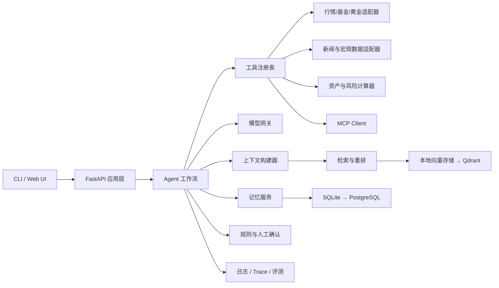

# 模块架构

## 1. 架构原则

- 业务逻辑不依赖具体模型厂商、数据库或行情供应商。
- LLM 负责理解、规划和生成；数值计算、权限与规则由普通代码负责。
- Agent 只能通过工具访问外部世界，所有工具调用均可记录、重放和测试。
- 先采用模块化单体，等边界稳定后再考虑拆服务。

## 2. 逻辑架构



## 3. 计划中的目录

```text
xmz-agent/
├─ apps/
│  ├─ api/                 # FastAPI 入口
│  ├─ cli/                 # 第一阶段命令行入口
│  └─ web/                 # 后期前端
├─ src/finagent/
│  ├─ core/                # 配置、通用 Schema、异常、事件
│  ├─ llm/                 # ModelProvider 接口、云端/本地适配器、路由
│  ├─ agents/              # Agent 定义与提示词
│  ├─ workflows/           # 可恢复的状态图与人工确认
│  ├─ tools/               # 工具协议、注册表、权限、具体工具
│  ├─ portfolio/           # 持仓、估值、暴露与风险计算
│  ├─ data/                # 行情/新闻/宏观数据源适配器
│  ├─ memory/              # 会话、用户偏好、情景/语义记忆
│  ├─ rag/                 # 采集、切分、索引、检索、重排、引用
│  ├─ context/             # 上下文选择、压缩、预算与缓存
│  ├─ mcp/                 # MCP Server 与 Client
│  ├─ guardrails/          # 输入输出校验、风险规则、批准策略
│  ├─ observability/       # 日志、指标、Trace、成本统计
│  └─ evaluation/          # 数据集、打分器与历史回放
├─ tests/
│  ├─ unit/
│  ├─ integration/
│  ├─ contract/
│  └─ eval/
├─ docs/
│  └─ learning-journal/
├─ data/
│  ├─ samples/             # 可提交的匿名样例
│  └─ private/             # 永不提交的个人数据
├─ scripts/
├─ .github/workflows/
├─ pyproject.toml
├─ .env.example
└─ README.md
```

## 4. 关键接口

后续优先稳定接口，而不是先堆实现：

```python
class ModelProvider(Protocol):
    async def generate(self, request: ModelRequest) -> ModelResponse: ...

class MarketDataProvider(Protocol):
    async def get_quote(self, symbol: str) -> Quote: ...

class PortfolioCalculator:
    def calculate(
        self,
        holdings: Sequence[Holding],
        quotes: Sequence[Quote],
    ) -> PortfolioSnapshot: ...

class Retriever(Protocol):
    async def search(self, query: SearchQuery) -> list[Evidence]: ...

class MemoryStore(Protocol):
    async def save(self, memory: MemoryItem) -> None: ...
    async def search(self, query: MemoryQuery) -> list[MemoryItem]: ...
```

这样可以独立替换模型、行情源、数据库和向量库，并对每个模块做假实现和契约测试。

## 5. 推荐技术栈

| 层 | 起步方案 | 进阶方案 | 学习目的 |
|---|---|---|---|
| 语言与工程 | Python、uv、Pydantic、pytest | Ruff、mypy、pre-commit | 类型、依赖、测试与代码质量 |
| 接口与 UI | CLI | FastAPI、Streamlit 或轻量 Web 前端 | API 设计、流式输出、异步编程 |
| Agent | 自写最小 ReAct 循环 | LangGraph 状态工作流 | 先懂原理，再学可靠编排 |
| 模型 | 一种 OpenAI-compatible 云 API | 多供应商网关、Ollama、本地模型 | 结构化输出、路由、降级、成本 |
| 数据库 | SQLite + SQLAlchemy | PostgreSQL + Alembic | 持久化、事务、迁移 |
| RAG | 本地向量索引 | Qdrant 混合检索 + 重排 | ingestion、召回、引用、评测 |
| 任务 | 手动触发 | APScheduler；需要时再引入队列 | 定时简报、失败重试、幂等性 |
| 协议 | 普通 Python 工具 | 官方 MCP Python SDK | 工具发现与跨应用复用 |
| 可观测性 | 结构化日志 | OpenTelemetry / Langfuse 类平台 | Trace、延迟、token、成本与错误 |
| 交付 | 本地运行 | Docker Compose、GitHub Actions | 可复现环境和自动化质量门禁 |

框架不是越多越好。主线只选一套，其他框架作为对比实验写进学习日记。

## 6. 数据与安全约束

- `Quote` 至少包含 `symbol`、`price`、`currency`、`as_of`、`source` 和 `is_delayed`。
- 过期或来源不明的数据不得被表述为实时事实。
- 原始文档、切分片段、引用和生成结论使用不同数据表。
- 调仓建议使用结构化 Schema，并经过规则检查与人工批准节点。
- MCP 工具采用最小权限、参数白名单、超时和审计日志。
- 个人持仓、Key、数据库文件和模型缓存加入 `.gitignore`。

## 7. 已实现的投资组合领域层

`src/finagent/portfolio/` 是独立的纯领域模块，不依赖 LLM、行情 SDK 或数据库：

```text
Holding + Quote
      │ Pydantic 校验
      ▼
PortfolioCalculator
      │ Decimal 确定性计算
      ▼
ValuedHolding + PortfolioSnapshot
```

- `models.py`：定义持仓、行情、单项估值和组合快照，并拒绝 float、负数与无时区行情。
- `rounding.py`：集中规定金额和百分比使用 `ROUND_HALF_UP` 保留两位。
- `calculator.py`：计算成本、市值、盈亏、收益率、权重、类别分布和 HHI。
- `errors.py`：区分重复持仓、重复行情、行情缺失和币种不匹配。

当前没有汇率换算，计算器要求全部持仓和行情使用同一基准币种。组合 `as_of` 取最旧
行情时间，避免用一条较新的行情掩盖其他资产的数据陈旧问题。

## 8. 已实现的市场数据抽象层

`src/finagent/data/` 把通用应用规则与具体供应商调用分开：

```text
CLI / Agent / Portfolio 应用
            │ 批量代码
            ▼
    MarketDataService
      │ 超时、顺序、新鲜度
      ▼
   MarketDataProvider 协议
      ├─ FakeMarketDataProvider → Quote
      ├─ AkShareFundNavProvider → 自有 QuoteCache → Quote
      ├─ GoldApiMarketDataProvider → 自有 QuoteCache → Quote
      └─ RoutingMarketDataProvider（组合 Provider）
            ├─ 显式基金白名单 → AkShareFundNavProvider
            └─ XAU-CNY-GRAM → GoldApiMarketDataProvider
```

- `base.py`：定义最小异步 Provider 协议与资产代码规范化。
- `fake.py`：从内存返回确定性行情，可模拟延迟、缺失和关闭状态。
- `service.py`：统一管理单请求超时、批量顺序、重复代码和行情年龄。
- `errors.py`：隔离缺失、超时、连接、限流、无效响应和陈旧行情异常。
- `cache.py`：使用单调时钟实现进程内 TTL 缓存，只保存已经校验的统一 `Quote`。
- `akshare.py`：在线程中执行 AKShare 同步调用，把开放式基金 DataFrame 转换为每日确认净值。
- `goldapi.py`：使用 httpx 异步请求 XAU/CNY，并把 24K 金价转换为人民币/克。
- `routing.py`：按显式基金代码集合和黄金常量选择子 Provider，不解析响应、不增加第二层缓存，
  也不把子 Provider 的超时或无数据错误改写成路由错误。
- `diagnostics.py`：独立检查两个真实数据源；PyCharm 入口位于
  `scripts/step05_check_real_market_data.py`。
- `scripts/step06_check_market_data_routing.py`：使用两个 Fake Provider 离线展示
  `Service → Router → 子 Provider` 数据流和请求轨迹，不读取 API Key。

当前批量请求采用串行策略，优先保证免费数据源限流友好和错误顺序确定。若后续选定的
真实供应商提供批量端点或允许并发，只需调整 Service/Provider 调度，不改变投资组合
计算器。AKShare 基金净值固定标记为延迟数据；GoldAPI 只表示国际黄金参考价，不能替代
京东积存金实际卖出价。外部响应无效时明确失败，不使用假行情静默降级。

Router 不能仅凭六位数字推断基金，因为基金和股票代码可能重叠。当前由应用在构造 Router
时传入已确认的基金代码集合，并在内存中保存为不可变 ``frozenset``；进程重启时会重新构造。
未来持仓持久化完成后，该集合应从基金持仓自动生成。缓存仍属于具体 Provider，因为基金
净值和黄金价格需要不同 TTL，Router 只负责确定性转发和子 Provider 生命周期。
