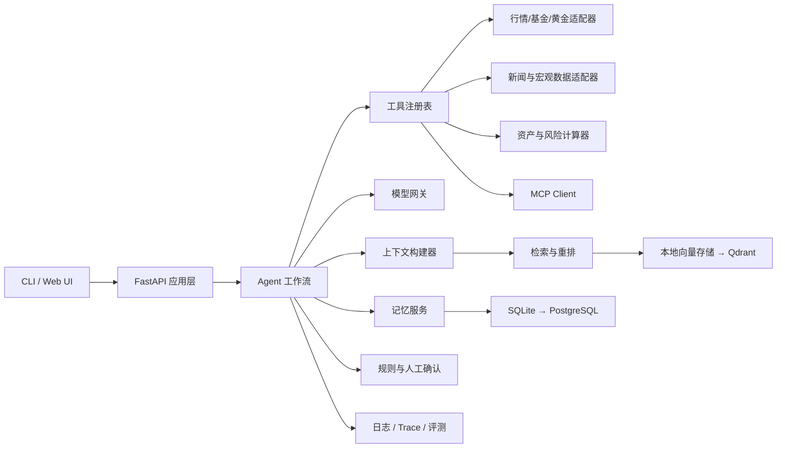
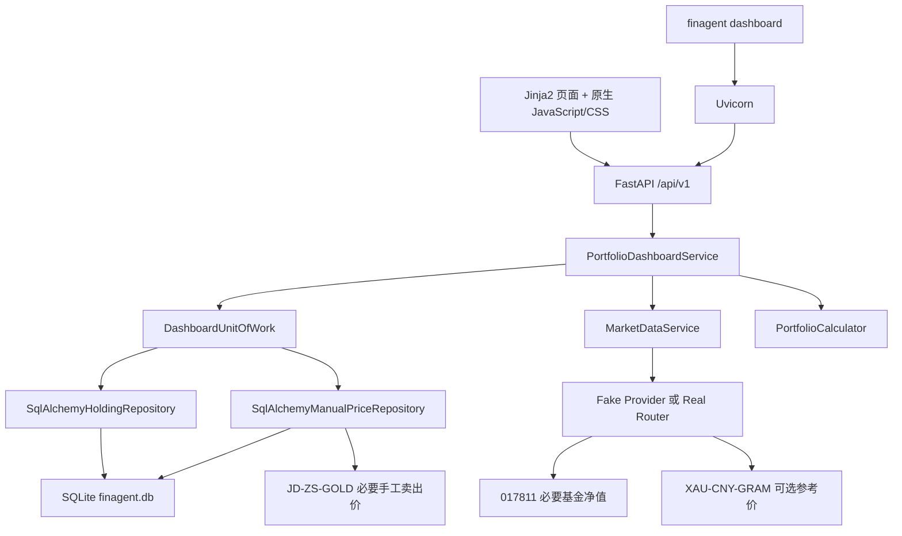

# 模块架构

## 1. 架构原则

- 业务逻辑不依赖具体模型厂商、数据库或行情供应商。
- LLM 负责理解、规划和生成；数值计算、权限与规则由普通代码负责。
- Agent 只能通过工具访问外部世界，所有工具调用均可记录、重放和测试。
- 先采用模块化单体，等边界稳定后再考虑拆服务。

## 2. 逻辑架构


```mermaid
flowchart LR
    UI["CLI / Web UI"] --> API["FastAPI 应用层"]
    API --> WF["Agent 工作流"]
    WF --> CTX["上下文构建器"]
    WF --> LLM["模型网关"]
    WF --> TOOLS["工具注册表"]
    WF --> MEM["记忆服务"]
    WF --> SAFE["规则与人工确认"]
    TOOLS --> MARKET["行情/基金/黄金适配器"]
    TOOLS --> NEWS["新闻与宏观数据适配器"]
    TOOLS --> PORT["资产与风险计算器"]
    TOOLS --> MCP["MCP Client"]
    CTX --> RAG["检索与重排"]
    MEM --> DB["SQLite → PostgreSQL"]
    RAG --> VDB["本地向量存储 → Qdrant"]
    WF --> OBS["日志 / Trace / 评测"]
```

## 3. 计划中的目录

```text
xmz-agent/
├─ apps/
│  ├─ api/                 # FastAPI 入口
│  ├─ cli/                 # 第一阶段命令行入口
│  └─ web/                 # 后期前端
├─ src/finagent/
│  ├─ core/                # 配置、通用 Schema、异常、事件
│  ├─ llm/                 # ModelProvider 接口、云端/本地适配器、路由
│  ├─ agents/              # Agent 定义与提示词
│  ├─ workflows/           # 可恢复的状态图与人工确认
│  ├─ tools/               # 工具协议、注册表、权限、具体工具
│  ├─ portfolio/           # 持仓、估值、暴露与风险计算
│  ├─ data/                # 行情/新闻/宏观数据源适配器
│  ├─ memory/              # 会话、用户偏好、情景/语义记忆
│  ├─ rag/                 # 采集、切分、索引、检索、重排、引用
│  ├─ context/             # 上下文选择、压缩、预算与缓存
│  ├─ mcp/                 # MCP Server 与 Client
│  ├─ guardrails/          # 输入输出校验、风险规则、批准策略
│  ├─ observability/       # 日志、指标、Trace、成本统计
│  └─ evaluation/          # 数据集、打分器与历史回放
├─ tests/
│  ├─ unit/
│  ├─ integration/
│  ├─ contract/
│  └─ eval/
├─ docs/
│  └─ learning-journal/
├─ data/
│  ├─ samples/             # 可提交的匿名样例
│  └─ private/             # 永不提交的个人数据
├─ scripts/
├─ .github/workflows/
├─ pyproject.toml
├─ .env.example
└─ README.md
```

## 4. 关键接口

后续优先稳定接口，而不是先堆实现：

```python
class ModelProvider(Protocol):
    async def generate(self, request: ModelRequest) -> ModelResponse: ...

class MarketDataProvider(Protocol):
    async def get_quote(self, symbol: str) -> Quote: ...

class PortfolioCalculator:
    def calculate(
        self,
        holdings: Sequence[Holding],
        quotes: Sequence[Quote],
    ) -> PortfolioSnapshot: ...

class Retriever(Protocol):
    async def search(self, query: SearchQuery) -> list[Evidence]: ...

class MemoryStore(Protocol):
    async def save(self, memory: MemoryItem) -> None: ...
    async def search(self, query: MemoryQuery) -> list[MemoryItem]: ...
```

这样可以独立替换模型、行情源、数据库和向量库，并对每个模块做假实现和契约测试。

## 5. 推荐技术栈

| 层 | 起步方案 | 进阶方案 | 学习目的 |
|---|---|---|---|
| 语言与工程 | Python、uv、Pydantic、pytest | Ruff、mypy、pre-commit | 类型、依赖、测试与代码质量 |
| 接口与 UI | CLI | FastAPI、Streamlit 或轻量 Web 前端 | API 设计、流式输出、异步编程 |
| Agent | 自写最小 ReAct 循环 | LangGraph 状态工作流 | 先懂原理，再学可靠编排 |
| 模型 | 一种 OpenAI-compatible 云 API | 多供应商网关、Ollama、本地模型 | 结构化输出、路由、降级、成本 |
| 数据库 | SQLite + SQLAlchemy | PostgreSQL + Alembic | 持久化、事务、迁移 |
| RAG | 本地向量索引 | Qdrant 混合检索 + 重排 | ingestion、召回、引用、评测 |
| 任务 | 手动触发 | APScheduler；需要时再引入队列 | 定时简报、失败重试、幂等性 |
| 协议 | 普通 Python 工具 | 官方 MCP Python SDK | 工具发现与跨应用复用 |
| 可观测性 | 结构化日志 | OpenTelemetry / Langfuse 类平台 | Trace、延迟、token、成本与错误 |
| 交付 | 本地运行 | Docker Compose、GitHub Actions | 可复现环境和自动化质量门禁 |

框架不是越多越好。主线只选一套，其他框架作为对比实验写进学习日记。

## 6. 数据与安全约束

- `Quote` 至少包含 `symbol`、`price`、`currency`、`as_of`、`source` 和 `is_delayed`。
- 过期或来源不明的数据不得被表述为实时事实。
- 原始文档、切分片段、引用和生成结论使用不同数据表。
- 调仓建议使用结构化 Schema，并经过规则检查与人工批准节点。
- MCP 工具采用最小权限、参数白名单、超时和审计日志。
- 个人持仓、Key、数据库文件和模型缓存加入 `.gitignore`。

## 7. 已实现的投资组合领域层

`src/finagent/portfolio/` 是独立的纯领域模块，不依赖 LLM、行情 SDK 或数据库：

```text
Holding + Quote
      │ Pydantic 校验
      ▼
PortfolioCalculator
      │ Decimal 确定性计算
      ▼
ValuedHolding + PortfolioSnapshot
```

- `models.py`：定义持仓、行情、单项估值和组合快照，并拒绝 float、负数与无时区行情。
- `rounding.py`：集中规定金额和百分比使用 `ROUND_HALF_UP` 保留两位。
- `calculator.py`：计算成本、市值、盈亏、收益率、权重、类别分布和 HHI。
- `errors.py`：区分重复持仓、重复行情、行情缺失和币种不匹配。

当前没有汇率换算，计算器要求全部持仓和行情使用同一基准币种。组合 `as_of` 取最旧
行情时间，避免用一条较新的行情掩盖其他资产的数据陈旧问题。

## 8. 已实现的市场数据抽象层

`src/finagent/data/` 把通用应用规则与具体供应商调用分开：

```text
CLI / Agent / Portfolio 应用
            │ 批量代码
            ▼
    MarketDataService
      │ 超时、顺序、新鲜度
      ▼
   MarketDataProvider 协议
      ├─ FakeMarketDataProvider → Quote
      ├─ AkShareFundNavProvider → 自有 QuoteCache → Quote
      ├─ GoldApiMarketDataProvider → 自有 QuoteCache → Quote
      └─ RoutingMarketDataProvider（组合 Provider）
            ├─ 显式基金白名单 → AkShareFundNavProvider
            └─ XAU-CNY-GRAM → GoldApiMarketDataProvider
```

- `base.py`：定义最小异步 Provider 协议与资产代码规范化。
- `fake.py`：从内存返回确定性行情，可模拟延迟、缺失和关闭状态。
- `service.py`：统一管理单请求超时、批量顺序、重复代码和行情年龄。
- `errors.py`：隔离缺失、超时、连接、限流、无效响应和陈旧行情异常。
- `cache.py`：使用单调时钟实现进程内 TTL 缓存，只保存已经校验的统一 `Quote`。
- `akshare.py`：在线程中执行 AKShare 同步调用，把开放式基金 DataFrame 转换为每日确认净值。
- `goldapi.py`：使用 httpx 异步请求 XAU/CNY，并把 24K 金价转换为人民币/克。
- `routing.py`：按显式基金代码集合和黄金常量选择子 Provider，不解析响应、不增加第二层缓存，
  也不把子 Provider 的超时或无数据错误改写成路由错误。
- `diagnostics.py`：独立检查两个真实数据源；PyCharm 入口位于
  `scripts/step05_check_real_market_data.py`。
- `scripts/step06_check_market_data_routing.py`：使用两个 Fake Provider 离线展示
  `Service → Router → 子 Provider` 数据流和请求轨迹，不读取 API Key。

当前批量请求采用串行策略，优先保证免费数据源限流友好和错误顺序确定。若后续选定的
真实供应商提供批量端点或允许并发，只需调整 Service/Provider 调度，不改变投资组合
计算器。AKShare 基金净值固定标记为延迟数据；GoldAPI 只表示国际黄金参考价，不能替代
京东积存金实际卖出价。外部响应无效时明确失败，不使用假行情静默降级。

Router 不能仅凭六位数字推断基金，因为基金和股票代码可能重叠。当前由应用在构造 Router
时传入已确认的基金代码集合，并在内存中保存为不可变 ``frozenset``；进程重启时会重新构造。
Phase 7 已完成持仓持久化，但资产目录仍是显式白名单；后续支持动态资产目录时，才从已确认的
资产元数据生成路由集合，不能直接根据六位代码猜测。缓存仍属于具体 Provider，因为基金净值和
黄金价格需要不同 TTL，Router 只负责确定性转发和子 Provider 生命周期。

## 9. 已实现的模拟持仓、资产面板与持久化边界

Phase 6 在既有领域层和行情层之上增加应用服务与 Web 边界；Phase 7 使用 Unit of Work 和
SQLAlchemy Repository 替换正式应用的内存状态，同时保留同一套 Service 与 API：


```mermaid
flowchart TD
    Browser["Jinja2 页面 + 原生 JavaScript/CSS"] --> API["FastAPI /api/v1"]
    CLI["finagent dashboard"] --> Server["Uvicorn"]
    Server --> API
    API --> Dashboard["PortfolioDashboardService"]
    Dashboard --> UOW["DashboardUnitOfWork"]
    UOW --> Holdings["SqlAlchemyHoldingRepository"]
    UOW --> ManualPrices["SqlAlchemyManualPriceRepository"]
    Holdings --> SQLite["SQLite finagent.db"]
    ManualPrices --> SQLite
    Dashboard --> Market["MarketDataService"]
    Market --> Provider["Fake Provider 或 Real Router"]
    Dashboard --> Calculator["PortfolioCalculator"]
    Provider --> Required["017811 必要基金净值"]
    Provider --> Reference["XAU-CNY-GRAM 可选参考价"]
    ManualPrices --> Gold["JD-ZS-GOLD 必要手工卖出价"]
```

### 9.1 各层职责

- `portfolio/`：保存资产、持仓和估值模型，并用 `Decimal` 完成纯确定性计算；不知道 HTTP、仓库或
  行情供应商。
- `dashboard/`：定义资产目录、仓库协议、Unit of Work 协议和 `PortfolioDashboardService`；负责
  编排持仓状态、事务边界、必要行情、可选黄金参考价和计算器。
- `persistence/`：实现 SQLAlchemy ORM、SQLite Repository 和 Unit of Work；同一次业务写入共享
  一个 AsyncSession，只有全部成功才提交。
- `web/api.py`：只负责请求校验、调用 Service、Decimal 字符串序列化和 HTTP 错误映射；不实现
  金融公式。
- `web/composition.py`：作为组合根，根据 `MARKET_DATA_MODE` 装配 Fake 或 Real Provider；正式
  应用装配 SQLite Unit of Work，测试与离线验收显式装配内存 Unit of Work。
- `web/templates/` 与 `web/static/`：作为 API 客户端展示结果，不在 JavaScript 中重复收益公式。
- `cli.py`：把 `finagent dashboard` 参数交给 Uvicorn；默认仅监听 `127.0.0.1`，开放局域网时提示
  无认证风险。

### 9.2 完整查询流程

```text
浏览器 GET /api/v1/dashboard
        ↓
FastAPI 调用 PortfolioDashboardService.get_dashboard()
        ↓
在短事务中从 SQLite 读取持仓和手工价格快照
        ↓
关闭数据库事务，不占用连接等待外部接口
        ↓
MarketDataService 查询基金必要行情
        ↓
PortfolioCalculator 计算毛/净口径、权重和 HHI
        ↓
存在京东黄金时，独立查询可降级的国际黄金参考价
        ↓
FastAPI 把 Decimal 序列化为字符串后返回网页
```

必要基金行情或京东手工价格缺失时，整个组合快照失败，避免展示残缺资产。国际黄金价格只用于参考，
其 Provider 失败时组合仍然成功，并把参考栏标记为 `unavailable`。空仓直接返回自洽快照，不访问任何
Provider。

### 9.3 状态与生命周期边界

正式应用使用 `SqlAlchemyDashboardUnitOfWorkFactory`：每次 Service 操作创建独立 AsyncSession，
持仓与手工价格写入必须在同一事务中成功后才提交，异常时整体回滚。应用启动时检查
`alembic_version` 是否为当前要求的迁移版本，但不会自动修改用户数据库；结构落后时提示执行
`uv run alembic upgrade head`。FastAPI lifespan 退出时依次关闭 MarketDataService、Router、真实
HTTP Provider 和数据库 Engine，释放 HTTP 与 SQLite 连接池。

`InMemoryDashboardUnitOfWorkFactory` 只保留给自动测试和离线验收。它用状态快照模拟提交与回滚，
从而让同一个 `PortfolioDashboardService` 可以在不修改业务代码的情况下切换存储实现。这正是
Repository 与 Unit of Work 抽象解决的问题。

### 9.4 API 与错误边界

正式 API 使用 `/api/v1`，金融数值统一传输为十进制字符串。主要错误映射如下：

| 场景 | HTTP 状态码 |
|---|---:|
| 不支持的资产、非法参数 | 422 |
| 重复持仓、演示冲突、手工价缺失或过期 | 409 |
| 持仓不存在 | 404 |
| 必要行情超时 | 504 |
| 其他必要行情不可用 | 503 |

这个边界保证领域异常不会泄漏为难以理解的 500，同时也不会把数据源失败伪装成正常行情。

## 10. 已实现的交易账本领域服务

Phase 7 的 `TransactionService` 在网页之外先建立可独立测试的交易业务边界：

```text
BuyRequest / SellRequest
        ↓
TransactionService（金额舍入、FIFO、业务校验）
        ↓
SqlAlchemy Unit of Work
        ├── holding_positions：当前状态投影
        ├── ledger_transactions：不可变交易事实
        ├── purchase_lots：各批剩余数量与单位成本
        └── manual_prices：黄金清仓时清除旧手工价
```

### 10.1 金额与批次口径

- 买入金额为 `数量 × 确认单价`，实际支出为买入金额加手续费；手续费计入该批单位成本。
- 卖出金额为 `数量 × 确认单价`，实际到账为卖出金额减手续费；已实现收益等于实际到账减去
  FIFO 批次成本。
- 数量、单价和单位成本最多保存 8 位小数；人民币金额使用 `ROUND_HALF_UP` 统一保留两位。
- 手续费使用平台显示的预计或最终金额，不硬编码产品费率。费率可能依持有时间和渠道变化，
  最终确认结果比通用规则更可靠。
- 卖出试算是只读操作；只有用户明确确认后调用 `record_sell`，才会更新数据库。

### 10.2 期初持仓与历史边界

Phase 6 创建的持仓只有数量和平均成本，没有原始买入流水。系统不会伪造历史交易；第一次通过
交易服务操作前，必须调用 `initialize_opening_position`，由用户提供取得时间并创建明确标记的
`opening` 流水和首个批次。当前版本只允许按时间顺序追加交易，插入更早历史需要重放之后全部
FIFO 结果，留待后续专门的账本重建能力处理。

交易写入共享同一个 AsyncSession。流水、批次和持仓任何一步失败，整个 Unit of Work 回滚；
清仓时持仓被删除，但历史流水和已归零批次继续保留用于审计。
